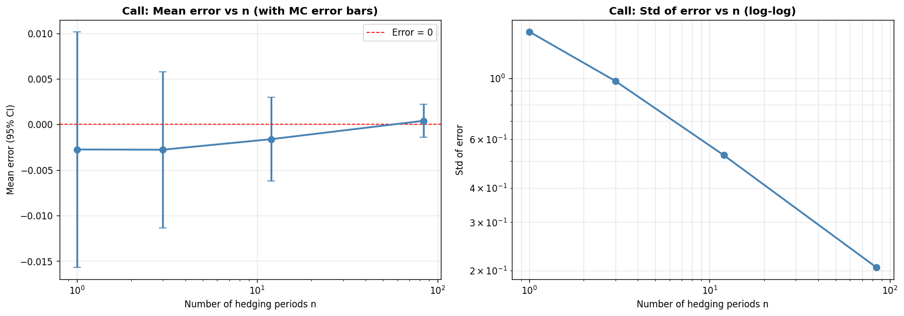

# Delta Hedging in the Black-Scholes Framework

A small, **tested** Python library and Monte-Carlo study of discrete-time delta
hedging of European and digital options under Black-Scholes. It quantifies how
hedging performance depends on **rebalancing frequency, drift, transaction costs,
volatility misspecification and model risk** — with every statistic reported
alongside its Monte-Carlo standard error.

> Rewritten from a single exploratory notebook into a packaged, tested project.
> The headline correctness and statistical-rigour fixes are summarised in
> [Methodology notes](#methodology-notes-what-changed-and-why).

---

## Highlights

- **Exact GBM simulation** (log-Euler), not biased arithmetic Euler — so the
  residual hedging error reflects discrete rebalancing, not discretisation bias.
- **Vectorised Monte-Carlo** over paths *and* steps, with **common random
  numbers** across frequencies and drifts (`50k`–`1M` paths run in seconds).
- **Signal vs noise discipline**: standard errors, confidence intervals and a
  proper power-law fit of the `1/√n` scaling law instead of a single ratio.
- **Transaction costs + Leland (1985)**: the cost/variance trade-off and its
  CVaR-optimal rebalancing frequency.
- **Volatility misspecification + the gamma-P&L identity**, validated against the
  simulation engine to three decimals.
- **Greeks-based P&L attribution** and **model risk** under Heston (stochastic
  volatility) and Merton (jump diffusion).
- **26 passing tests** (`pytest`) covering put-call parity, finite-difference
  Greeks, the self-financing identity, reproducibility and headline numbers.

## Repository layout

```
src/deltahedge/        # the library
  black_scholes.py     # call/digital price, delta, gamma, vega, theta (vectorised)
  paths.py             # exact-GBM simulator (+ CRN, Heston, Merton)
  hedging.py           # discrete delta-hedge engine, transaction costs, Leland, gamma-P&L
  analysis.py          # MC summaries with standard errors, power-law fit, VaR/CVaR
  plotting.py          # histograms + convergence plots with error bars
tests/                 # pytest suite (correctness, reproducibility, regression)
notebooks/             # Delta_Hedging_Analysis.ipynb — thin narrative over the package
figures/               # exported PNGs (regenerated by the notebook)
report/                # delta_hedging_report.md — the write-up
```

## Installation

```bash
pip install -e ".[dev]"      # Python >= 3.10
pytest                       # run the test suite
jupyter nbconvert --to notebook --execute --inplace notebooks/Delta_Hedging_Analysis.ipynb
```

## Quick start

```python
import deltahedge as dh
from deltahedge import hedging as hg, analysis as an

r, sigma, S0, K, T = 0.10, 0.20, 100.0, 90.0, 0.25

# Common random numbers across frequencies, exact GBM, 100k paths.
paths = dh.crn_gbm_paths(S0, mu=r, sigma=sigma, T=T,
                         n_values=[0, 1, 3, 12, 84], n_paths=100_000, rng=42)

results = {n: hg.hedge_call(paths[n], K, r, sigma, T, hedge=(n > 0)).error
           for n in paths}
print(an.summary_table(results))     # mean ± sem, 95% CI, std, p-value per frequency
```

## Model and parameters

The risky asset follows `dS = μ S dt + σ S dW`; the money account grows at `r`.
We sell an option of price `V(t,S)` and hold the self-financing hedge
`π = Δ S + β B` with `Δ = ∂V/∂S`, rebalanced at `n` discrete dates. The reported
quantity is the hedger's terminal P&L `ε = π(T) − payoff`.

Baseline: `r = 10%`, `σ = 20%`, `S₀ = 100`, `K = 90`, `T = 0.25y`.
Frequencies `n ∈ {0, 1, 3, 12, 84}` (and `252` for the digital).

**Day-count convention.** The project uses calendar weeks (1 year = 12 months,
1 month = 4 weeks, 1 week = 7 days), so over a quarter `n = 84` is
*calendar*-daily. A real trading quarter has ~63 trading days; this convention is
documented rather than relabelled, and the digital's `n = 252` corresponds to
~4 rebalances per trading day.

## Key results

| Study | Result |
|---|---|
| **Call convergence (`μ=r`)** | Mean error is **statistically zero at every `n`** (martingale property); the *std* collapses `9.6 → 0.21` (`n=0→84`). |
| **`1/√n` scaling** | Fitted exponent `−0.47 ± 0.01` on `n ≥ 3` (`n=1` is a static hedge, excluded). The single `7.9×` ratio is *not* the right test. |
| **Drift `μ`** | Dispersion **does** depend on `μ` (std `0.25 → 0.16` as `μ: −0.1 → 0.3`), though the mean stays zero. |
| **Digital option** | Bimodal error; scaling exponent only `≈ −0.25` — does **not** obey `1/√n`. |
| **Transaction costs** | Real cost/variance trade-off; 5% CVaR has an **interior optimal frequency**. Leland's adjusted vol improves cost-adjusted P&L. |
| **Vol misspecification** | Mean error sign `= sign(σ_real² − σ_hedge²)`; the gamma-P&L identity matches the engine to 3 decimals. |
| **Model risk** | BS-delta hedge std `0.21 → 0.64` (Heston) → `1.49` (Merton); jump tails dominate the loss CVaR. |



See [`report/delta_hedging_report.md`](report/delta_hedging_report.md) for the
full discussion and [`figures/`](figures) for all plots.

## Methodology notes (what changed, and why)

This project began as a single notebook. An audit found the core Black-Scholes
maths correct (pricing, Greeks and the self-financing accounting all check out)
but surfaced issues that this version fixes:

- **Exact GBM everywhere.** The original used arithmetic Euler-Maruyama for `n>0`
  but exact GBM for `n=0`; the resulting `O(dt)` bias was being read as a
  "hedging error mean". Switching to exact GBM removes the bias (and any
  negative-price risk) — the mean error is then exactly zero in expectation.
- **Standard errors on everything.** At `N=1000` the standard error of the mean
  was larger than the means quoted to 4–6 decimals; the "mean converges to 0" and
  "non-monotonic digital mean" narratives were Monte-Carlo noise (`p > 0.05`).
  Means are now reported with their `sem`/CI and labelled *consistent with zero*.
- **Drift sensitivity corrected.** "Variance is independent of `μ`" was false; it
  is shown to depend on `μ` using common random numbers.
- **`1/√n` law fitted, not asserted.** A log-log regression (excluding the static
  `n=1`) replaces the misleading single ratio.
- **Reproducibility.** `np.random.default_rng` with per-call seeding replaces a
  single global `np.random.seed`, so results no longer depend on cell order.

## Author

Dan Allouche — [report](report/delta_hedging_report.md) · MIT License
